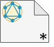
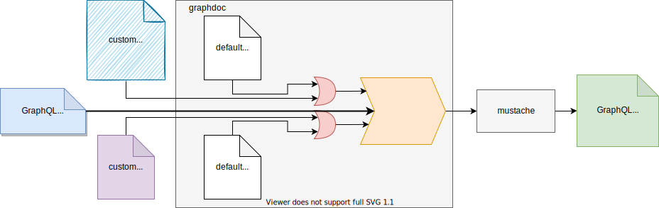

   
  

<h1 align="center">GraphQL documentation using graphdoc plugins</h1>

## Graphdoc

[`"@2fd/graphdoc"`](https://www.npmjs.com/package/@2fd/graphdoc) package creates HTML documentation for [GraphQL](https://graphql.org/) from the provided schema.
graphdoc bases its HTML generation on on [mustache](https://mustache.github.io/mustache.5.html) and plugins.

[How to configure graphdoc](docs/how-to-configure-graphdoc.md).

[How graphdoc work](docs/how-graphdoc-works.md).

## Graphdoc Plugins

Graphdoc plugins have the duty of process the [GraphQL](https://graphql.org/) schema and provide the display information that is going to be used in [mustache](https://mustache.github.io/mustache.5.html) templates.

Custom graphdoc plugins:

* [graphdoc-plugin-flexible](docs/graphdoc-plugin-flexible.md)
* [graphdoc-plugin-operations](docs/graphdoc-plugin-operations.md)
* [graphdoc-plugin-erase](docs/graphdoc-plugin-erase.md)
* [graphdoc-plugin-schema](docs/graphdoc-plugin-schema.md)

## Online Examples

* Pokemon GraphQL schema: [Project](https://github.com/gmullerb/base-graphdoc-yarn) and [Online generated documentation](https://gmullerb.gitlab.io/base-graphdoc-yarn).
* Github GraphQL schema: [Project](https://github.com/gmullerb/base-graphdoc-npm) and [Online generated documentation](https://gmullerb.gitlab.io/base-graphdoc-npm).
