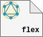
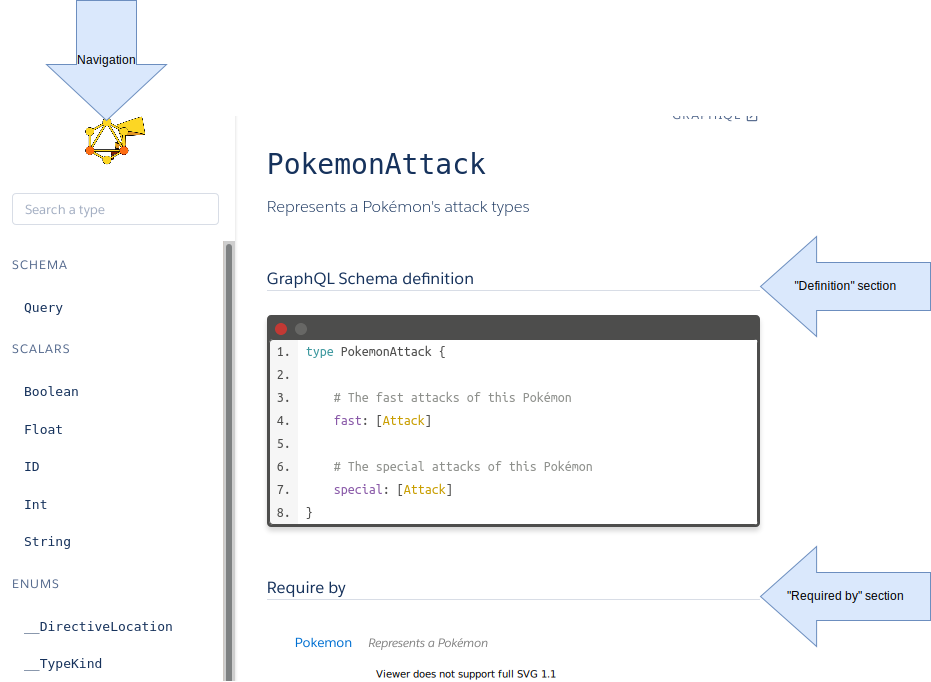

<p align="center">
  <br/>
  <a href="https://graphdoc-plugins.github.io"></a>
</p>

<h1 align="center">GraphQL documentation with Flexible graphdoc</h1>

[](https://graphdoc-plugins.github.io)
[](https://www.npmjs.com/package/graphdoc-plugin-flexible)
[](https://www.npmjs.com/package/graphdoc-plugin-flexible)
[](LICENSE.txt)
[](https://gmullerb.gitlab.io/graphdoc-plugin-flexible/tests/tests_report.html)
[](https://gmullerb.gitlab.io/graphdoc-plugin-flexible/coverage/index.html)
[](https://github.com/gmullerb/graphdoc-plugin-flexible)
[](https://gitlab.com/gmullerb/graphdoc-plugin-flexible)

__________________

## Quick Start

1 . Add dependencies:

`package.json`:

```json
  "devDependencies": {
    "@2fd/graphdoc": "2.4.0",
    "graphdoc-plugin-flexible": "1.0.2",
```

2 . Configure `graphdoc-plugin-flexible`, e.g. without `navigation.schema` plugin:

`package.json`:

```json
{
  "graphdoc-plugin-flexible": {
    "navigation.schema": {
      "disable": true
    }
  }
}
```

3 Use `graphdoc-plugin-flexible`:

`package.json`:

```json
  "scripts": {
    "doc": "graphdoc -p graphdoc/../../graphdoc-plugin-flexible -s ./schema.graphql -o ./build/documentation"
  }
```

> **When using `graphdoc-plugin-flexible`, the graphdoc plugins must NOT be used**, it will duplicate outputs.  
> `graphdoc/../../` this is required to get external plugins working in `graphdoc`.

__________________

## Goals

`graphdoc-plugin-flexible` provides a way to use [`graphdoc`](https://www.npmjs.com/package/@2fd/graphdoc) to create HTML documentation for GraphQL in an flexible way, i.e. if you use [`graphdoc`](https://github.com/2fd/graphdoc) with its default plugins, you will have to use it all, for navigation creation, for document creation and with all its assets, `graphdoc-plugin-flexible` plugin will allow to select which plugins you want to use from [`graphdoc`](https://www.npmjs.com/package/@2fd/graphdoc), so use only what you need or use other plugins (e.g. [`graphdoc-plugin-operations`](https://www.npmjs.com/package/graphdoc-plugin-flexible)) without overlapping.

## Options

`package.json`:

(*default values*)

```json
{
  "graphdoc-plugin-flexible": {
    "navigation.schema": {
      "disable": true,
      "navigations": false,
      "documents": false,
      "assets": false
    },
    "navigation.scalar": {
      "disable": true,
      "navigations": false,
      "documents": false,
      "assets": false
    },
    "navigation.enum": {
      "disable": true,
      "navigations": false,
      "documents": false,
      "assets": false
    },
    "navigation.interface": {
      "disable": true,
      "navigations": false,
      "documents": false,
      "assets": false
    },
    "navigation.union": {
      "disable": true,
      "navigations": false,
      "documents": false,
      "assets": false
    },
    "navigation.object": {
      "disable": true,
      "navigations": false,
      "documents": false,
      "assets": false
    },
    "navigation.input": {
      "disable": true,
      "navigations": false,
      "documents": false,
      "assets": false
    },
    "navigation.directive": {
      "disable": true,
      "navigations": false,
      "documents": false,
      "assets": false
    },
    "document.schema": {
      "disable": true,
      "navigations": false,
      "documents": false,
      "assets": false
    },
    "document.require": {
      "disable": true,
      "navigations": false,
      "documents": false,
      "assets": false
    }
  }
}
```

The plugins provided by [`graphdoc`](https://www.npmjs.com/package/@2fd/graphdoc) are:

* `navigation.schema`: Generates navigations for GraphQL schema.
* `navigation.scalar`: Generates navigations for GraphQL scalar types.
* `navigation.enum`: Generates navigations for GraphQL enum types.
* `navigation.interface`: Generates navigations for GraphQL interface types.
* `navigation.union`: Generates navigations for GraphQL union types.
* `navigation.object`: Generates navigations for GraphQL object types.
* `navigation.input`: Generates navigations for GraphQL input types.
* `navigation.directive`: Generates navigations for GraphQL directives.
* `document.schema`: Generates the HTML "Definition" section for any GraphQL element.
* `document.require`: Generates HTML "Required By" section for any GraphQL element.

The following shows the sections worked by the [`graphdoc`](https://www.npmjs.com/package/@2fd/graphdoc) plugins, using the example created by [`graphdoc`](https://www.npmjs.com/package/@2fd/graphdoc), [Pokemon GraphQL](https://2fd.github.io/graphdoc/pokemon/pokemonattack.doc.html):



The options for the plugins are:

* `navigations`: if set to `false`, then it will disable the navigation creation process of the plugin, i.e. plugin `getNavigations` will not be called.
* `documents`: if set to `false`, then it will disable the document creation process of the plugin, i.e. plugin `getDocuments` will not be called.
* `assets`: if set to `false`, then it will disable all the assets provided by the plugin, i.e. plugin `getHeaders` and `getAssets` will not be called.
* `disable`: if set to `true`, then it will disable the plugin completely, i.e. equal to `"navigations": false` + `"documents": false` + `"assets": false`.

__________________

## Prerequisites

* [`"@2fd/graphdoc": "2.4.0"`](https://www.npmjs.com/package/@2fd/graphdoc/v/2.4.0).

> graphdoc can work with older versions of GraphQL (description syntax: #), and new versions (description syntax: """), [How to configure graphdoc](https://graphdoc-plugins.github.io/docs/how-to-configure-graphdoc.html).

__________________

## Main documentation

[Back to homepage](../README.md)
