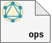
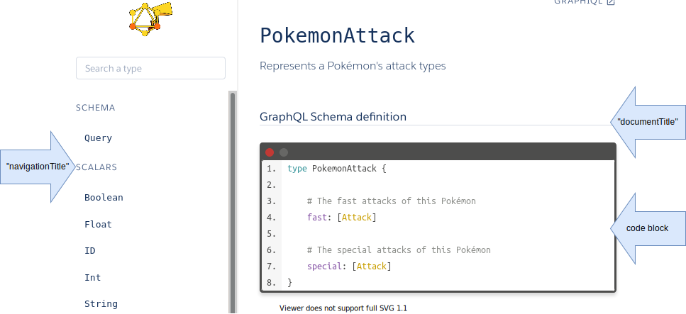

<p align="center">
  <br/>
  <a href="https://graphdoc-plugins.github.io"></a>
</p>

<h1 align="center">GraphQL schema HTML documentation generation, using graphdoc with Isolated Operations</h1>

[](https://graphdoc-plugins.github.io)
[](https://www.npmjs.com/package/graphdoc-plugin-operations)
[](https://www.npmjs.com/package/graphdoc-plugin-operations)
[](LICENSE.txt)
[](https://gmullerb.gitlab.io/graphdoc-plugin-operations/tests/tests_report.html)
[](https://gmullerb.gitlab.io/graphdoc-plugin-operations/coverage/index.html)
[](https://github.com/gmullerb/graphdoc-plugin-operations)
[](https://gitlab.com/gmullerb/graphdoc-plugin-operations)

__________________

## Quick Start

1 . Add dependencies:

`package.json`:

```json
  "devDependencies": {
    "@2fd/graphdoc": "2.4.0",
    "graphdoc-plugin-operations": "2.0.0",
    "graphdoc-plugin-flexible": "1.0.2",
```

2 . If default options are not suitable, then configure `graphdoc-plugin-operations`:

`package.json`:

```json
{
  "graphdoc-plugin-operations": {
    "documentTitle": "The Description",
    "navigationTitle": "The Operations",
    "enableAssets": false
  }
}
```

3 Use `graphdoc-plugin-operations`:

`package.json`:

```json
  "scripts": {
    "doc": "graphdoc -p graphdoc/../../graphdoc-plugin-operations -p graphdoc/../../graphdoc-plugin-flexible  -p graphdoc/../../graphdoc-plugin-schema -s ./schema.graphql -o ./build/documentation"
  },
  "graphdoc-plugin-flexible": {
    "document.schema": { "disable": true }
  },
  "devDependencies": {
    "@2fd/graphdoc": "2.4.0",
    "graphdoc-plugin-flexible": "1.0.2",
    "graphdoc-plugin-operations": "2.0.0",
    "graphdoc-plugin-schema": "2.0.0",
```

> `graphdoc-plugin-flexible` is required to disable `document.schema` plugin and  allow custom types.  
> `graphdoc-plugin-schema` will substitute disabled `document.schema` plugin when required.  
> `graphdoc/../../` this is required to get external plugins working in `graphdoc`.

__________________

## Goals

`graphdoc-plugin-operations` provides a way document operations independently using [`graphdoc`](https://www.npmjs.com/package/@2fd/graphdoc).

## Options

`package.json`:

(*default values*)

```json
{
  "graphdoc-plugin-operations": {
    "documentTitle": "Description",
    "navigationTitle": "Operations",
    "enableAssets": true
  }
}
```

* `documentTitle`: title of the document section.
* `navigationTitle`: title of the operations section in the navigation.
* `enableAssets`: if set to `false`, then it will disable all the assets provided by the plugin, i.e. script and css files will not be included.

The following shows where the `documentTitle`, the `navigationTitle` and the "code block" are located, using the example documentation created by [`graphdoc`](https://www.npmjs.com/package/@2fd/graphdoc), [Pokemon GraphQL HTML Documentation](https://2fd.github.io/graphdoc/pokemon/pokemonattack.doc.html), using [Pokemon GraphQL schema](https://github.com/lucasbento/graphql-pokemon):



## Using/Configuration

* To use `graphdoc-plugin-operations` is necessary that `document-schema` plugin is disabled (since it doesn't allow custom types), use [`graphdoc-plugin-flexible`](https://graphdoc-plugins.github.io) plugin:

`package.json`

```json
  "scripts": {
    "doc": "graphdoc -p graphdoc/../../graphdoc-plugin-operations  -p graphdoc/../../graphdoc-plugin-flexible -s ./schema.graphql -o ./build/documentation"
  },
  "devDependencies": {
    "@2fd/graphdoc": "2.4.0",
    "graphdoc-plugin-flexible": "1.0.2"
  },
  "graphdoc-plugin-flexible": {
    "document.schema": { "disable": true }
  },
  "devDependencies": {
    "@2fd/graphdoc": "2.4.0",
    "graphdoc-plugin-flexible": "1.0.2",
    "graphdoc-plugin-operations": "2.0.0",
    "graphdoc-plugin-schema": "2.0.0",
```

> You can use [`graphdoc-plugin-schema`](https://graphdoc-plugins.github.io) plugin as an alternative to  `document-schema` plugin.

* `main.mustache` template may need some changes in other to get a better view, e.g.:

    *&#123;&#123;#type}}  
      &#123;&#123;^type.methodName}}&#60;p class="slds-text-title--caps slds-text-color--weak">&#123;&#123;type.kind}}&#60;/p>&#123;&#123;/type.methodName}}  
      &#123;&#123;#type.methodName}}&#60;p class="slds-text-title--caps slds-text-color--weak">Operation&#60;/p>&#123;&#123;/type.methodName}}  
    &#123;&#123;/type}}*

## Online Examples

* Pokemon GraphQL schema: [Project](https://github.com/gmullerb/base-graphdoc-yarn) and [Online generated documentation](https://gmullerb.gitlab.io/base-graphdoc-yarn).
* Github GraphQL schema: [Project](https://github.com/gmullerb/base-graphdoc-npm) and [Online generated documentation](https://gmullerb.gitlab.io/base-graphdoc-npm).

__________________

## Prerequisites

* [`"@2fd/graphdoc": "2.4.0"`](https://www.npmjs.com/package/@2fd/graphdoc/v/2.4.0).

> graphdoc can work with older versions of GraphQL (description syntax: #), and new versions (description syntax: """), [How to configure graphdoc](https://graphdoc-plugins.github.io/docs/how-to-configure-graphdoc.html).  

__________________

## Main documentation

[Back to homepage](../README.md)
