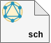

<p align="center">
  <br/>
  <a href="https://graphdoc-plugins.github.io"></a>
</p>

<h1 align="center">GraphQL schema HTML documentation generation, using configurable graphdoc document-schema plugin</h1>

[](https://graphdoc-plugins.github.io)
[](https://www.npmjs.com/package/graphdoc-plugin-schema)
[](https://www.npmjs.com/package/graphdoc-plugin-schema)
[](LICENSE.txt)
[](https://gmullerb.gitlab.io/graphdoc-plugin-schema/tests/tests_report.html)
[](https://gmullerb.gitlab.io/graphdoc-plugin-schema/coverage/index.html)
[](https://github.com/gmullerb/graphdoc-plugin-schema)
[](https://gitlab.com/gmullerb/graphdoc-plugin-schema)

__________________

## Quick Start

1 . Add dependencies:

`package.json`:

```json
  "devDependencies": {
    "@2fd/graphdoc": "2.4.0",
    "graphdoc-plugin-schema": "2.0.0",
```

2 . If default options are not suitable, then configure `graphdoc-plugin-schema`:

`package.json`:

```json
{
  "graphdoc-plugin-schema": {
    "documentTitle": "The Description",
    "enableAssets": false
  }
}
```

3 Use `graphdoc-plugin-schema`:

`package.json`:

```json
  "scripts": {
    "doc": "graphdoc -p graphdoc/../../graphdoc-plugin-schema  -p graphdoc/../../graphdoc-plugin-flexible -s ./schema.graphql -o ./build/documentation"
  },
  "graphdoc-plugin-flexible": {
    "document.schema": { "disable": true }
  },
  "devDependencies": {
    "@2fd/graphdoc": "2.4.0",
    "graphdoc-plugin-flexible": "1.0.2",
    "graphdoc-plugin-schema": "2.0.0",
```

> `graphdoc-plugin-flexible` is required to avoid duplication when graphdoc default plugins are used.  
> `graphdoc/../../` this is required to get external plugins working in `graphdoc`.

__________________

## Goals

`graphdoc-plugin-schema` provides a way to use [`graphdoc`](https://www.npmjs.com/package/@2fd/graphdoc) default `document-schema` plugin with other custom kinds without breaking (being also faster than `document-schema`).

## Options

`package.json`:

(*default values*)

```json
{
  "graphdoc-plugin-schema": {
    "documentTitle": "Description",
    "enableAssets": true
  }
}
```

* `documentTitle`: title of the document section.
* `enableAssets`: if set to `false`, then it will disable all the assets provided by the plugin, i.e. script and css files will not be included.

The following shows where the `documentTitle` and the "code block" are located, using the example documentation created by [`graphdoc`](https://www.npmjs.com/package/@2fd/graphdoc), [Pokemon GraphQL HTML Documentation](https://2fd.github.io/graphdoc/pokemon/pokemonattack.doc.html), using [Pokemon GraphQL schema](https://github.com/lucasbento/graphql-pokemon):


## Using/Configuration

* To use `graphdoc-plugin-schema` is necessary that `document-schema` plugin is disabled (to avoid duplication), use [`graphdoc-plugin-flexible`](https://graphdoc-plugins.github.io) plugin:

`package.json`

```json
  "scripts": {
    "doc": "graphdoc -p graphdoc/../../graphdoc-plugin-schema  -p graphdoc/../../graphdoc-plugin-flexible -s ./schema.graphql -o ./build/documentation"
  },
  "graphdoc-plugin-flexible": {
    "document.schema": { "disable": true }
  },
  "devDependencies": {
    "@2fd/graphdoc": "2.4.0",
    "graphdoc-plugin-flexible": "1.0.2",
    "graphdoc-plugin-schema": "2.0.0",
```

## Online Examples

* Pokemon GraphQL schema: [Project](https://github.com/gmullerb/base-graphdoc-yarn) and [Online generated documentation](https://gmullerb.gitlab.io/base-graphdoc-yarn).
* Github GraphQL schema: [Project](https://github.com/gmullerb/base-graphdoc-npm) and [Online generated documentation](https://gmullerb.gitlab.io/base-graphdoc-npm).

__________________

## Prerequisites

* [`"@2fd/graphdoc": "2.4.0"`](https://www.npmjs.com/package/@2fd/graphdoc/v/2.4.0).

> graphdoc can work with older versions of GraphQL (description syntax: #), and new versions (description syntax: """), [How to configure graphdoc](https://graphdoc-plugins.github.io/docs/how-to-configure-graphdoc.html).  

__________________

## Main documentation

[Back to homepage](../README.md)
