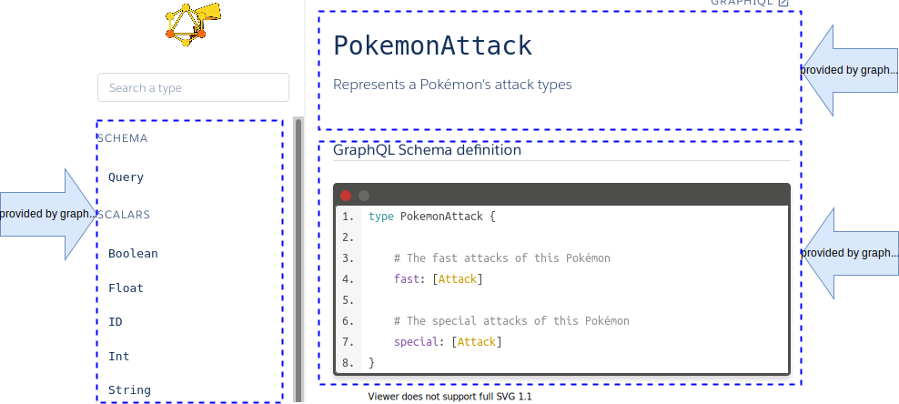
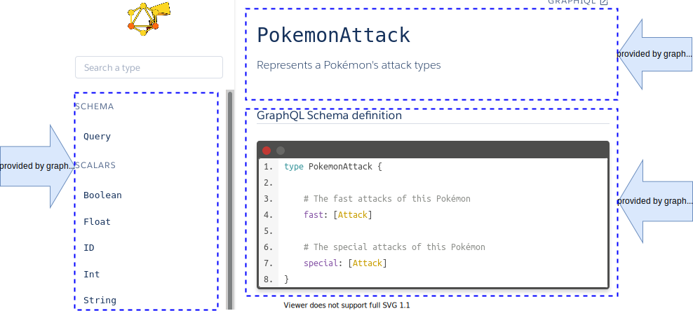
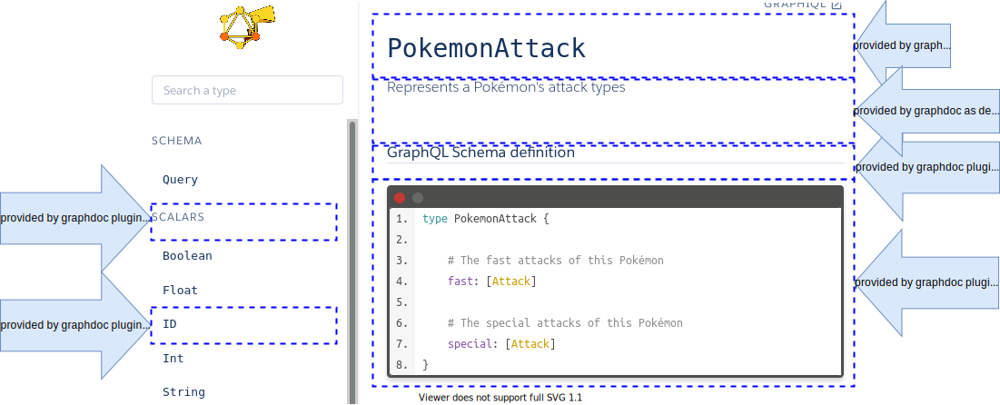
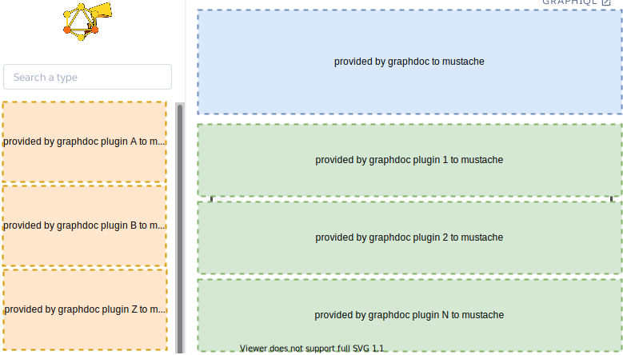

# How graphdoc works

__________________

__________________

__________________

__________________

| Graphdoc              | GraphQL           |
|-----------------------|-------------------|
| graphdoc title        | type name         |
| graphdoc description  | type description  |
| graphdoc plugin title | depends on plugin |
| graphdoc description  | depends on plugin |

__________________

## Main documentation

[Back to homepage](../README.md)
